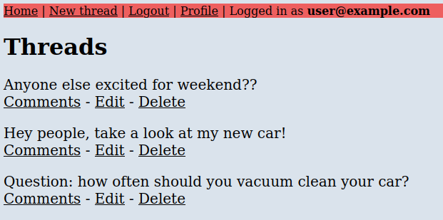

# Flask Forum

- [Flask Forum](#flask-forum)
  - [Getting Flask Forum up and running](#getting-flask-forum-up-and-running)
    - [Requirements](#requirements)
    - [Dependencies](#dependencies)
    - [Run build](#run-build)
      - [Development](#development)
      - [Production](#production)

## Getting Flask Forum up and running

Live demo at http://joonaskulmala.me/

### Requirements

**Python 3** or newer is required. Latest LTS is recommended. Python version used for developing is **3.8.5**.

### Dependencies

Install Python dependencies with **apt** or **pip**

* python3-flask
* python3-flask-sqlalchemy
* python3-wtforms

### Run build

#### Development

In development you can run the application with `python3 app.py`.

From `app.py` make sure you have last 2 lines not commented out:

    # Remove from production deployment build
        if __name__ == "__main__":
    app.run()

#### Production

Proper production server is recommended.

My guide to deployment using Apache2 web server: [w22 monday | Joonas Kulmala](https://github.com/JoonasKulmala/Python-weppipalvelu/tree/main/w22/monday)